# Fact Atlas agent system / Agent 系统

Fact Atlas uses agents as bounded responsibility owners and Skills as reusable operating procedures. An Agent answers **who owns this outcome**; a Skill answers **how a repeatable step is executed and checked**. The distinction is represented in code by [`server/agent-architecture.mjs`](../server/agent-architecture.mjs), returned by the live APIs, and rendered in both Relay and Signals.

Fact Atlas 把 Agent 定义为有边界的责任主体，把 Skill 定义为可复用、可检验的工作程序。Agent 回答“谁对结果负责”，Skill 回答“这个步骤如何稳定执行并被检查”。两者不是只存在于概念图里，而是写进服务端契约、API 返回值和前端界面。

## Two main agents / 两个主 Agent

```mermaid
flowchart LR
    U["Human · 用户"] --> SS["Signal Supervisor · 全球信号主理人"]
    SS --> T["One of 8 topic agents · 八个主题子 Agent 之一"]
    T --> S1["Public scan + date window + dedupe"]
    S1 --> G1["Gonka attention funnel · 重要性筛选"]
    G1 --> H1["Human selects a candidate · 用户选择候选"]
    H1 --> RS["FactRelay Supervisor · 事实核验主理人"]
    RS --> E["Evidence Scout · 证据侦察"]
    E --> I["Kimi Investigator · Kimi 调查方"]
    I --> K["MiniMax Skeptic · MiniMax 质疑方"]
    K --> J["Deterministic Judge · 确定性裁决"]
    J --> R["Receipt Keeper · 回执记录"]
    R --> H2["Human Atlas gate · 人工入库闸门"]
```

The Signal Supervisor is an attention system, not a truth system. It narrows a dated public-source window into a small set of checkable claims. The FactRelay Supervisor then performs the deeper evidence case. This prevents a news-ranking model from quietly becoming the final arbiter of truth.

Signals 主 Agent 只管理注意力，不管理真伪：它把某日版次对应的公开来源窗口压缩成少量可核验候选。FactRelay 主 Agent 才负责深度证据核查，从结构上避免“新闻排序分数”被偷换成“真实度”。

## Signals: supervisor → topic agent → Skills

The user chooses one date and one topic. The supervisor routes the request to exactly one topic agent, which shares the same tested Skills with the other topics.

| Topic subagent / 主题子 Agent | Scope / 边界 |
| --- | --- |
| AI Frontier · AI 前沿 | Models, compute, governance, and deployment |
| Technology · 科技 | Platforms, chips, security, and infrastructure |
| Markets · 金融 | Markets, policy, payment rails, and systemic risk |
| Climate & Energy · 气候能源 | Climate evidence, energy systems, and transition |
| Science · 科学 | Research results, methods, and institutions |
| Health & Bio · 健康生物 | Public health, medicine, and biotechnology |
| Cities & Culture · 城市文化 | Urban change, media, culture, and public life |
| Public Policy · 公共政策 | Regulation, institutions, and civic impact |

Shared Skills:

1. `global-public-scan` — query multiple Google/Bing regional public feeds concurrently;
2. `date-window` — bind the edition date to a transparent seven-day source window;
3. `source-normalize` — retain title, publisher, URL, timestamp, origin, and image;
4. `duplicate-collapse` — deterministically merge cross-aggregator duplicates;
5. `gonka-attention-funnel` — ask Kimi through GonkaRouter to rank importance and extract a checkable claim;
6. `relay-handoff` — transfer the exact claim and source to FactRelay only after user selection.

Every news card remains linked to its original public source. `importance` is capped and normalized, but it is never displayed or stored as a Truth Score.

## Relay: supervisor → adversarial case → human gate

| Subagent / 子 Agent | Responsibility / 职责 | Primary Skill / 主要 Skill |
| --- | --- | --- |
| Claim Intake · 主张受理 | Bound input and normalize a checkable claim | Input safety |
| Evidence Scout · 证据侦察 | Retrieve current public evidence | Evidence retrieval |
| Investigator · 调查方 | Build the strongest source-grounded case | Gonka adversarial review |
| Skeptic · 质疑方 | Attack omissions, laundering, and causal leaps | Source grounding |
| Deterministic Judge · 确定性裁决 | Calculate the score from bounded outputs | Truth Score |
| Receipt Keeper · 回执记录 | Preserve request IDs, timings, and status | Provenance trace |

The models do not vote on a final number. They return bounded verdicts and per-source assessments. Deterministic code rejects nonexistent source indexes, collapses repeated citations, calculates the Truth Score, and lowers confidence when evidence is weak or models disagree. Only a user can approve placement in the Atlas.

两个模型不直接投票生成最终分数。它们只返回有边界的结论和逐来源评估；确定性代码负责拒绝虚构来源索引、合并重复引用、计算 Truth Score，并在证据不足或模型分歧时降低信心。最后是否进入知识星球必须由用户确认。

## Handoff contracts / 交接契约

| From → to | Required payload | Rejected when |
| --- | --- | --- |
| Signal topic agent → FactRelay | exact claim, source URL, publisher, selected date, Gonka ranking receipt | user did not select the candidate |
| Evidence Scout → Investigator | numbered, deduplicated source packet | no usable public source exists |
| Investigator → Skeptic | same source packet + investigator draft labeled untrusted | draft or source indexes are malformed |
| Models → Deterministic Judge | normalized verdicts and valid per-source assessments | both model attempts fail strict JSON parsing |
| FactRelay → Atlas | complete report snapshot; optional user-confirmed coordinates | user has not approved storage |

## Autonomy and failure boundaries / 自主性与失败边界

- Deterministic filters run before inference to reduce context pollution and cost.
- One malformed model response gets one strict same-model retry; both attempts remain in the trace.
- A missing or failed source feed degrades to partial evidence instead of being replaced by invented content.
- Signals date editions never claim a single-day exhaustive crawl; the UI names the actual seven-day coverage window.
- No AI agent chooses coordinates or publishes to the Atlas.
- No hidden AI provider substitutes for GonkaRouter.

The local books supplied for design research informed the attention funnel, planner/executor/verifier separation, explicit handoffs, deterministic hooks, and gradual-autonomy boundaries. No book text or assets are redistributed.

